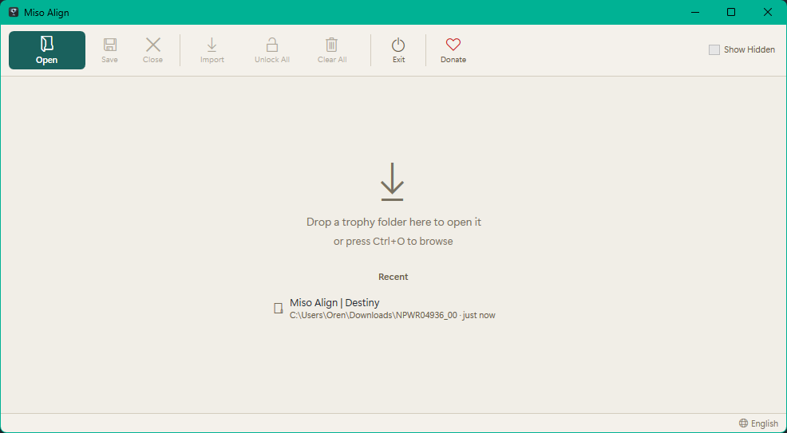
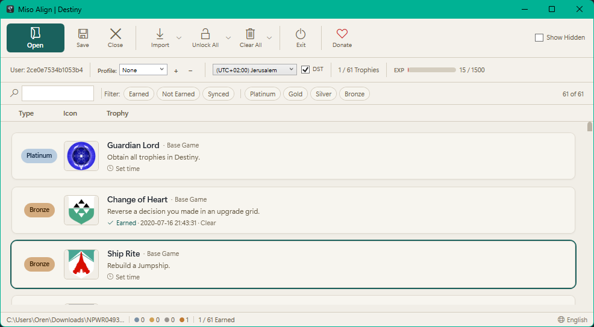
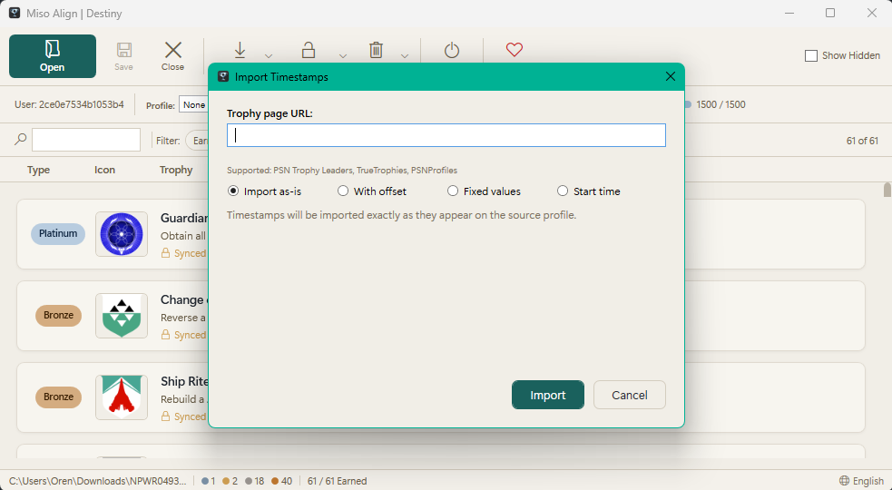

<div align="center">

A modern, portable PS3 trophy editor & profile resigner

[![][license-shield]][license-shield-link]

</div>

## Features

### Trophy Editing
- **Open & decrypt** PS3 trophy folders with native AES/HMAC-SHA1 encryption
- **RPCS3 support** — edit trophies from the PS3 emulator (unencrypted format)
- **Unlock, lock, and edit timestamps** on individual or multiple trophies
- **Instant Platinum** — unlock all trophies with randomized chronological timestamps
- **Instant Unlock** — unlock all trophies at a specific time or the current time
- **Batch operations** — unlock, lock, or clear multiple selected trophies at once
- **Clear trophies** — remove earned timestamps, with optional inclusion of synced trophies

### Import & Export
- **Import from websites** — PSN Trophy Leaders, TrueTrophies, and PSNProfiles
- **Import from text files** — `Trophy Name | YYYY-MM-DD HH:MM:SS` format
- **Import modes** — as-is, with time offset, fixed date overrides, or relative start time
- **Profile resigning** — resign trophy folders to a different PSN account

### User Experience
- **Drag-and-drop** folder loading
- **Recent files** — quickly reopen previously edited trophy folders
- **Search & filter** — find trophies by name, filter by type (Platinum/Gold/Silver/Bronze) or status (Earned/Not Earned/Synced)
- **Timezone-aware** timestamp display with DST control
- **Keyboard shortcuts** — Ctrl+O, Ctrl+S, Ctrl+W, Ctrl+F, Space, Enter, Delete, F1

### 12 Languages
English, العربية, Deutsch, Español, Français, עברית, 日本語, 한국어, Português, Русский, 简体中文, 繁體中文

Full RTL support for Hebrew and Arabic.

### Accessibility
- Screen reader compatible (AutomationProperties on all interactive elements)
- Full keyboard navigation with visible focus indicators
- Windows High Contrast mode support
- WCAG 2.2 AA contrast-compliant color system
- Reduced motion support (respects system animation settings)

### Portable
- **No installation required** — self-contained executable with bundled .NET 8 runtime
- **All data stored locally** — settings, profiles, and recent files live next to the executable
- Copy the folder to any Windows 10+ machine and run

## Screenshots

<div align="center">



<br/><br/>



<br/><br/>



</div>

## Download

Download the latest release from [GitHub Releases](https://github.com/Miso-Solutions/Trophic/releases).

Or build from source (see below).

## Build from Source

### Prerequisites
- [.NET 8.0 SDK](https://dotnet.microsoft.com/download/dotnet/8.0)

### Build
```bash
dotnet build src/Trophic/Trophic.csproj --configuration Release
```

### Publish (self-contained portable)
```bash
dotnet publish src/Trophic/Trophic.csproj --configuration Release --output publish
```

The post-publish step automatically organizes the output: the executable and native runtime DLLs remain in the root, while managed DLLs and satellite assemblies are placed in a `lib/` subfolder.

### Run Tests
```bash
dotnet test
```

## Usage

### Opening Trophy Files
1. Copy your trophy folder from your PS3: `/dev_hdd0/home/000000XX/trophy/TROPHYID`
2. Open the folder in the editor — drag-and-drop, Ctrl+O, or use the Open button
3. Edit trophies as desired
4. Save (Ctrl+S) to encrypt and write changes back

### Profile Resigning
1. Click the **+** button next to the Profile dropdown
2. Select a `PARAM.SFO` file containing the target PSN account ID
3. Name the profile and select it from the dropdown
4. Save — the trophy folder will be resigned to the selected account

### Importing Timestamps
1. Click **Import** and select "From website..." or "From text file..."
2. For websites: paste a game URL from PSN Trophy Leaders, TrueTrophies, or PSNProfiles
3. Choose an import mode:
   - **As-is** — timestamps imported exactly as they appear
   - **With offset** — add or subtract time from all timestamps
   - **Fixed values** — override specific date/time components
   - **Start time** — shift all timestamps relative to a chosen start date

### Changing Language
Click the language button in the bottom-right corner of the status bar. Select a language from the dropdown — the app will restart in the chosen language. Your selection is saved automatically.

### Keyboard Shortcuts
| Shortcut | Action |
|----------|--------|
| Ctrl+O | Open trophy folder |
| Ctrl+S | Save |
| Ctrl+W | Close file |
| Ctrl+F | Focus search |
| Ctrl+A | Select all trophies |
| Space | Toggle earned/locked |
| Enter | Edit timestamp |
| Delete | Clear selected timestamps |
| F1 | Toggle shortcuts help |
| Escape | Dismiss overlay / clear search |

## Runtime Requirements

- **Windows 10** or later
- **Google Chrome** — required only for PSNProfiles import (Cloudflare bypass)

> Note: the portable build bundles the .NET runtime. No separate .NET installation is needed.

## Warning

Modifying and syncing trophies to PSN carries risk of account suspension. Use at your own risk.

## Support the Project

If Trophic has been useful, consider supporting its development:

[![][ko-fi-shield]][ko-fi-link]

## License

Copyright (c) 2025 Miso Solutions. All rights reserved. Free for personal use only. See [LICENSE](LICENSE) for details.

<!-- Link Definitions -->
[license-shield]: https://img.shields.io/badge/license-proprietary-white?labelColor=black&style=flat-square
[license-shield-link]: LICENSE
[ko-fi-shield]: https://img.shields.io/badge/Ko--fi-F16061?style=for-the-badge&logo=ko-fi&logoColor=white
[ko-fi-link]: https://ko-fi.com/misosolutions
